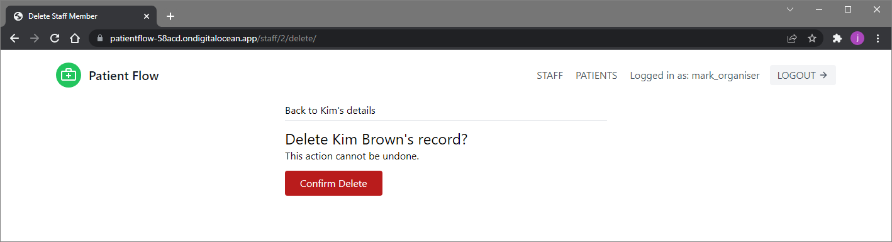

Patient Flow is an appointment triage app created with Django.
It's at an early stage of development with a handful of initial features implemented.

# First iteration

The features included in the first iteration are summarised below. 

## Staff Member

There are currently two user types: staff member and organiser. The features available
to a staff member are described in this section.

### Login and password reset

The login screen includes a *Forgot password?* option that can be used to generate an
email containing a password reset link.

### Patient list

The patient list can be accessed via the *PATIENTS* link in the navbar.
It contains a list of all the patients assigned to the logged-in staff member.
The patients are separated into categories that reflect the stages of the appointment
triage process. There is also a category at the bottom of the screen containing every
patient assigned to the staff member — this includes those that are not 
currently involved in the appointment process.

### Patient overview

The patient overview screen is accessed by clicking one of the *View patient* links 
on the patient list screen. It summarises key information such as the selected patient's
contact details and the staff member they are assigned to.

### Appointment status

The appointment status page is used to set the stage of the process that the patient is
at. This is done via a dropdown list. Changing the status on this screen will move the
patient to the associated category on the patient list screen.

The priority of the appointment can also be set here.

### Patient update

This is where the patient's details can be updated, including the staff member they
are assigned to.

Note that clicking the logo in the top left-hand corner on any page will return the
user to the homepage.

## Organiser

The additional features available to an organiser are described in this section.

### Staff member list

The staff member list can be accessed via the *STAFF* link in the navbar. It contains
a list of all the staff members that belong to the same organisation as the organiser. 

### Add staff member

As its name suggests, this screen can be used to add a new staff member.
In addition to the username and other basic details, the person's role in the practice
can be set.

A *Back to staff list* option is provided as well.

### Staff member overview

The staff member overview is accessed by clicking one of the *View staff member* links 
on the staff member list page. It summarises key information such as the selected
staff member's email address and role.

### Staff member update

This is where the staff member's details can be updated. The organiser also has the
option to delete the staff member from the system.

### Staff member delete

If the delete option is selected, a confirmation screen will be displayed.

### Patient list

Unlike staff members, who only see the patients they have been assigned, organisers see
all the practice's patients, separated into the same categories. An additional *Unassigned*
category is also visible at the top of the list, making it possible to quickly identify
any patients who aren't currently assigned to staff members.

### Add patient

Organisers have two extra options on the staff list screen: *Add patient* and *View stats*.

*Add patient* performs a similar function to *Add staff member*.
It also gives organisers the ability to assign a patient to a staff member straight away.

### View stats

The view stats screen shows the total number of patients in each appointment category
for the whole practice.  

### Stat detail

Clicking a category name on the view stats screen takes the organiser to the associated
stat detail page, where the names of each patient currently at this stage of
the appointment process can be seen.

Clicking a patient's name will then display the relevant patient overview page.

### Patient update

Organisers also have access to a delete option on the patient update screen.

# Future iterations

A few of the features that could be added following feedback are listed below:

- An improved patient list layout suitable for viewing and filtering large volumes of patients.
- A separate appointment model to enable multiple appointments/assignments per patient.
- Additional user types, such as a practice receptionist role that can view/assign all
patients without the ability to delete.
- Integration with common GP practice IT systems.
